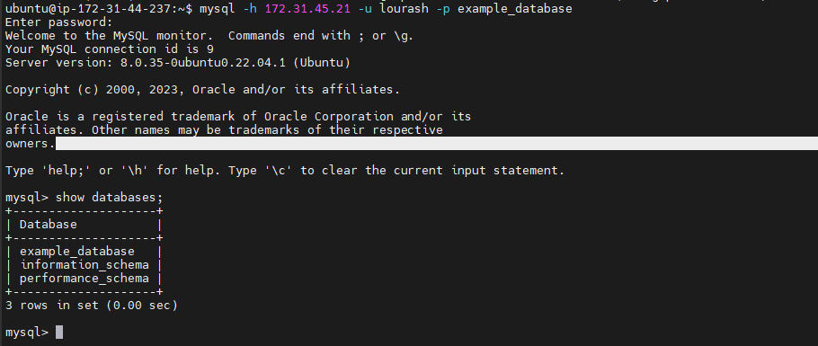

**Project-5**

**Client-Server Architecture with MySQL**

As you proceed your journey into the world of IT, you will begin to realise that certain concepts apply to many other areas. One of such concepts is -  Client-Server architecture.
Client-Server refers to an architecture in which two or more computers are connected together over a network to send and receive requests between one another.
In their communication, each machine has its own role: the machine sending requests is usually referred as "Client" and the machine responding (serving) is called "Server".


### TASK – Implement a Client Server Architecture using MySQL Database Management System (DBMS).

1.  Create and configure two Linux-based virtual servers (EC2 instances in AWS).

  ```bash
   Server A name - `mysql server`
   Server B name - `mysql client`
```

 run sudo apt update on both servers
```bash
  sudo apt update
```
2.  On mysql server Linux Server install MySQL Server software.
```bash
    sudo apt install mysql-server
```
log in to the MySQL console by typing:
```bash
$ sudo mysql
```
This will connect to the MySQL server as the administrative database user root, which is inferred by the use of sudo when running this command. You should see output like this:

```bash
Welcome to the MySQL monitor.  Commands end with ; or \g.
Your MySQL connection id is 11
Server version: 8.0.22-0ubuntu0.20.04.3 (Ubuntu)

Copyright (c) 2000, 2020, Oracle and/or its affiliates. All rights reserved.

Oracle is a registered trademark of Oracle Corporation and/or its
affiliates. Other names may be trademarks of their respective
owners.

Type 'help;' or '\h' for help. Type '\c' to clear the current input statement.

mysql>
```


It’s recommended that you run a security script that comes pre-installed with MySQL. This script will remove some insecure default settings and lock down access to your database system. Before running the script you will set a password for the root user, using mysql_native_password as default authentication method. We’re defining this user’s password as PassWord.1.
```bash
ALTER USER 'root'@'localhost' IDENTIFIED WITH mysql_native_password BY 'PassWord.1';
```


3.  On mysql client Linux Server install MySQL Client software.

```bash
    sudo apt install mysql-client
```

4.  By default, both of the EC2 virtual servers are located in the same local virtual network, so they can communicate to each other using local IP addresses. Use mysql server's local IP address to connect from mysql client. MySQL server uses TCP port 3306 by default, so you will have to open it by creating a new entry in ‘Inbound rules’ in ‘mysql server’ Security Groups. For extra security, do not allow all IP addresses to reach your ‘mysql server’ – allow access only to the specific local IP address of your ‘mysql client’.


Create a database to test 
To create a new database, run the following command from your MySQL console:

```bash 
CREATE DATABASE `example_database`;
```

Now you can create a new user and grant him full privileges on the database you have just created.
The following command creates a new user named example_user, using mysql_native_password as default authentication method. We’re defining this user’s password as PassWord.1, but you should replace this value with a secure password of your own choosing.

```bash
CREATE USER 'lourash'@'%' IDENTIFIED WITH mysql_native_password BY 'PassWord.1';
```

Now we need to give this user permission over the example_database database:
```bash
GRANT ALL ON example_database.* TO 'lourash'@'%';
```

This will give the example_user user full privileges over the example_database database, while preventing this user from creating or modifying other databases on your server.
Now exit the MySQL shell with:
```bash
mysql> exit
```


You can test if the new user has the proper permissions by logging in to the MySQL console from the MYSQL Client, this time using the custom user credentials:
```bash
mysql -h 172.31.43.127 -u lourash -p example_database
```



After confirming that you have valid connection on the client server, you can exit the MySQL console:

```bash
exit
```
